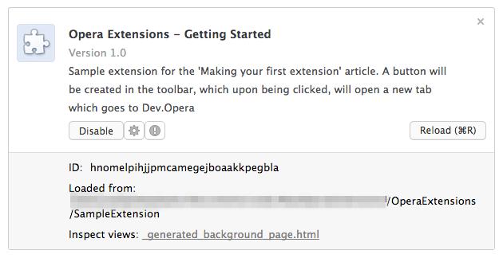
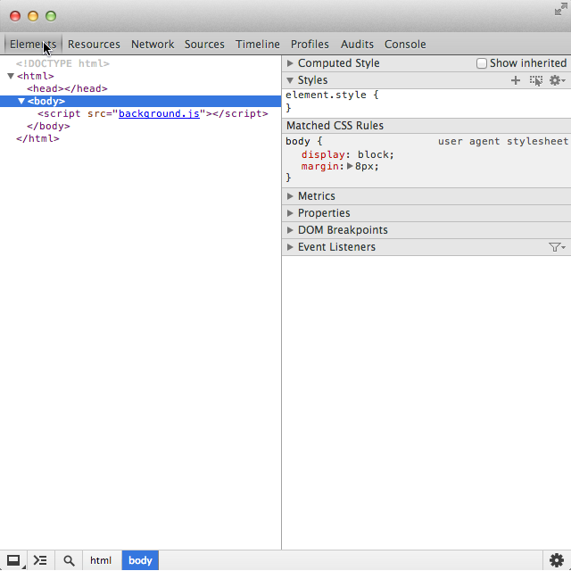

Testing and debugging is an important part of the development process. Let's take a look at how to debug and test extensions in Opera.

## Developer Mode
The first thing to do is to enable developer mode. You can do it by going to the *opera:extensions* page and then clicking on '*Developer Mode*'. 

This will enable developer mode which will give a bunch of options to play with. At the top level, you will notice the options *Load Unpacked Extension*, *Pack Extension*, and *Update Extensions Now* as seen below.

## Loading an unpacked extension

You do not need to create an extension package before you test it. You can start just from the time you create a new directory for your extension. Once you have all your necessery files in place (like the manifest file, icons, background scripts, etc) you can load the extension in *Developer Mode* just by clicking '*Load Extension*, and then select the directory of that extension.

Doing this will create an entry for that extension in the page, like so:

There are few things to note here. Apart from the usual *Disable*, *Options* and *Permissions* buttons on the left, you also now have a *Reload* button on the right. Whenever you make a change in your extension, you can instantly see the results by clicking the *Reload* button. This will reload the extension with the updated code. This is one of the most important things to know when developing extensions, and you will need this a lot! 

On the bottom half, you will see the ID of the extension mentioned. You can load various resources in an extension from the address bar if you know the extension ID by using the *chrome-extension://* protocol. For example, by typing *chrome-extension//&lt;extensionID&gt;/manifest.json* in the address bar, it will load the manifest file of that extension in the tab. You can refer to files internally in your extension using this protocol too.

## Inspecting elements 

Below where it states the ID, it mentions the directory where the extension resides, and below that, there is a field called *Inspect views*. This field provides a link to inspect resources in the extension.

Clicking on that will open the Developer Tools for Opera, and will give you all the resources to inspect elements within it, just like you have for normal web pages. 

If your extension has a popup, and you want to inspect it, then all you need to do is to click on the button to open the popup (as a user might normaly do) and then right-click in that popup and select *Inspect Element*. 

The developer tools give you a lot of power when it comes to debugging as you can set breakpoints, go step-by-step and analyze various variables, change things in the page to see how it would look like, etc.

